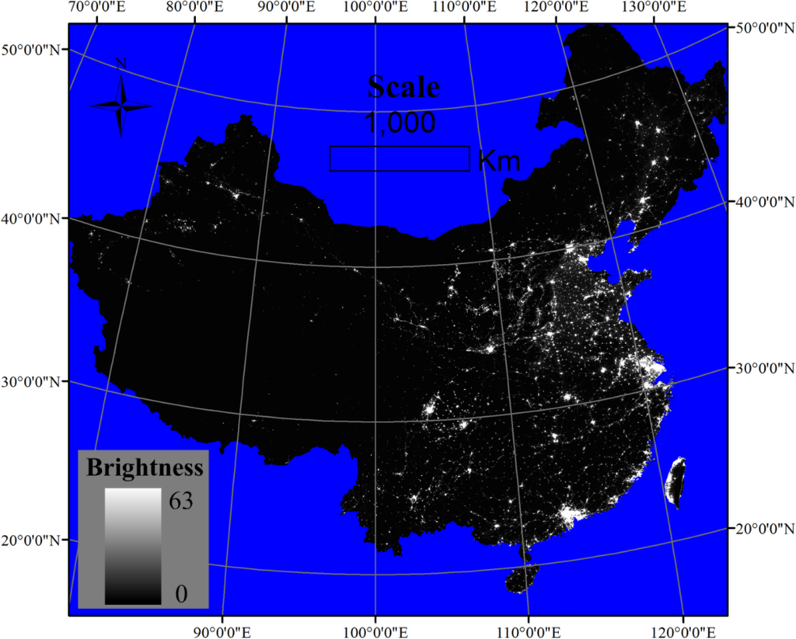

```{r setup, include=FALSE}
options(htmltools.dir.version = FALSE, htmltools.preserve.raw = FALSE)
library(xaringanExtra)
```

```{r xaringan-all, echo=FALSE, warning=FALSE}
library(xaringan)
library(xaringanExtra)
hook_source <- knitr::knit_hooks$get('source')
knitr::knit_hooks$set(source = function(x, options) {
  x <- stringr::str_replace(x, "^[[:blank:]]?([^*].+?)[[:blank:]]*#<<[[:blank:]]*$", "*\\1")
  hook_source(x, options)
})
xaringanExtra::use_broadcast()
xaringanExtra::use_freezeframe()
xaringanExtra::use_scribble()
#xaringanExtra::use_slide_tone()
xaringanExtra::use_search(show_icon = TRUE, auto_search	=FALSE)
xaringanExtra::use_freezeframe()
xaringanExtra::use_clipboard()
xaringanExtra::use_tile_view()
xaringanExtra::use_panelset()
xaringanExtra::use_editable(expires = 1)
xaringanExtra::use_fit_screen()
xaringanExtra::use_extra_styles(
  hover_code_line = TRUE,         
  mute_unhighlighted_code = TRUE  
)
```

class: center, title-slide, middle

background-image: url("background.jpg")
background-size: cover
background-position: center

# Visible Infrared Imaging Radiometer Suite

## Operational Earth observations at moderate resolution

### Yudan Zhang

### `r format(Sys.time(), "%d/%m/%Y")`

---
class: left
.center[
# About VIIRS
]

- The Visual Infrared Imaging Radiometer Suite (VIIRS) is one of five primary sensors on the NOAA and NASA-led Suomi National Polar-orbiting Partnership (S-NPP) and Joint Polar Satellite System (JPSS) satellite programmes
- VIIRS was initially used to observe clouds and measure surface variables (temperature, vegetation, etc.), providing two types of Key Performance Parameters (KPPs): Sea Surface Temperature (SST) and Image


```{r echo=FALSE, out.width = "40%", fig.align='center', cache=FALSE}
knitr::include_graphics('viirs-instrument.jpg') 
```
Source:[NOAA](https://www.star.nesdis.noaa.gov/jpss/VIIRS.php) 
---
# About VIIRS

.panelset[
.panel[.panel-name[Inheritance]

- VIIRS "inherits" many sensors from its predecessors
- Advanced Very-high Resolution Radiometer (AVHRR), on NOAA's Polar-orbiting Environmental Satellites (POES)

- Moderate-resolution Imaging Spectroradiometer (MODIS), on NASA's Earth Observing System (EOS)

- Operational Linescan System (OLS), on DoD's Defense Meteorological Satellite Program (DMSP)
]
.panel[.panel-name[Temporal Resolution]
- The higher level VIIRS land products (e.g. Level 3 and Level 4) distributed from the NASA’s Land Processes Distributed Active Archive Center (LP DAAC) are produced at various temporal resolutions. 
- The following time increments are available for VIIRS land products: Daily, 8-Day, 16-Day, Monthly, Yearly 
```{r echo=FALSE, out.width = "40%", fig.align='center', cache=FALSE, fig.cap="VIIRS data-based temporal evolution of the estimated TADR (m 3 /s) from 4 July to 30 August 2019. "}
 
```
Source:[USGS](https://lpdaac.usgs.gov/data/get-started-data/collection-overview/missions/s-npp-nasa-viirs-overview/), [Plank et al. 2019](https://www.mdpi.com/2072-4292/11/23/2879)

]
.panel[.panel-name[Spatial Resolution]
- Bands I1-5: 375m
- Bands M1-16: 750m
- The higher level VIIRS land products distributed from the LP DAAC are produced at three nominal spatial resolutions: 500 m; 1,000 m; and 5,600 m (0.05 degrees)
```{r echo=FALSE, out.width = "40%", fig.align='center', cache=FALSE, fig.cap="VIIRS Band Centers, Spatial Resolution, and Gain"}
 
```
Source:[USGS](https://lpdaac.usgs.gov/data/get-started-data/collection-overview/missions/s-npp-nasa-viirs-overview/), [NOAA Technical Report](https://www.star.nesdis.noaa.gov/jpss/documents/AMM_All/VIIRS_SDR/Provisional/VIIRS_USERS_GUIDE_TechReport142FINAL_cc_rdlnCmts_cc_020192013.pdf)
]
]

---
class: left
.center[
# Products
]
.pull-left[


| Categories | Product Examples |
|-----------------|-----------------|
| Aerosols        | Aerosol optical thickness, Aerosol particle size parameter, Suspended matter    |
| Clouds          | Imagery, Cloud mask, Cloud optical thickness, Cloud effective particle size parameter, Cloud top parameters    |
| Land            | Active Fires, Land surface Albedo, Land surface temperature, Ice surface temperature    |
| Ocean    | Sea surface temperature, Ocean color   |

]
.pull-right[

This image product shows the ability of high-resolution imagery to determine sea ice extent and ice edges using false color imagery
Source:[NOOA](https://www.star.nesdis.noaa.gov/jpss/VIIRS.php), [Hillger et al. 2014](https://agupubs-onlinelibrary-wiley-com.libproxy.ucl.ac.uk/doi/full/10.1002/2013JD021170)
]
---
# Research example 1

.pull-left[
- Expansion of the MODIS active fire record with the VIIRS sensor and subsequent Joint Polar Satellite System (JPSS) series[(Li et al. 2013)](https://www.mdpi.com/2072-4292/5/6/3057)
- 750 metres Suomi NPP Data Development Level 2 Active Fire (NDEAF-L2) providing daily global active fire data
- On continental scales and in most fire clusters, VIIRS fire radiant power is roughly comparable to MODIS fire radiant power over the same period of time. the VIIRS average fire radiant power per pixel is fairly stable across the strip
]
.pull-right[

Global active fire detections from Aqua Moderate Resolution Imaging Spectroradiometer (MODIS) and Suomi National Polar-orbiting Partnership Visible Infrared Imaging Radiometer Suite (VIIRS) on 15 September 2016
Image credit:[Li et al. 2013](https://www.mdpi.com/2072-4292/5/6/3057)
]

---
# Research example 2

.pull-left[
- NPP-VIIRS data can be used to model global and regional economies, especially in regions where economic census data are difficult to obtain. The use of regression modelling to predict regional GRP from the use of NPP-VIIRS data[(Hillger et al. 2014)](https://agupubs-onlinelibrary-wiley-com.libproxy.ucl.ac.uk/doi/full/10.1002/2013JD021170)
- A mask with all positive pixels was generated from the 2010 DMSP-OLS image and the NPP-VIIRS image was multiplied by the mask to obtain a denoised nighttime light image. Elimination of non-economic activity related confounders
- NPP-VIIRS data found to be more predictive of GRP than DMSP-OLS data
]
.pull-right[

2012 NPP-VIIRS Nighttime Lighting Imagery of China's Landmasses
Image credit:[Hillger et al. 2014](https://agupubs-onlinelibrary-wiley-com.libproxy.ucl.ac.uk/doi/full/10.1002/2013JD021170)
]
---
# Reflections on the use of this sensor-Advantages

.pull-left[
## Clear resolution advantage, wide range of application scenarios
- VIIRS, equipped with multiple spectral bands spanning from visible to infrared, captures comprehensive details of Earth's surface and atmosphere and offers high-resolution images, supporting diverse applications in oceanography, climatology, environmental monitoring, agriculture, forestry, and more
]
.pull-right[
## Unique imaging capabilities
- The VIIRS Day/Night Band captures nocturnal surface lights and human activities, offering global coverage useful for analyzing human activity, urbanization, and energy use.

]
---
class: left
.center[
# Reflections on the use of this sensor-Limitation
]

## Sensor's own limitations
- As an instrument on a polar-orbiting satellite, VIIRS's daily revisit cycle limits its use in situations where rapid monitoring updates are required. As with all optical sensors, VIIRS performance may be limited in cloudy or inclement weather conditions where clouds can block the view from the ground. Spatial resolution is low compared to geosynchronous orbiting satellites 

##Insufficient interpretation of a single dataset
- VIIRS night-time light data, useful for assessing the night-time economy, requires supplementing with local economic data for regional modeling, as it cannot be the sole source for accurate analysis
---
class: left
.center[
# Reflections and perspectives for future work
]

VIIRS (sensors do have some limitations and future research efforts could focus on technological advances and ways to overcome these limitations

## Breaking through the limitations of the sensor itself
- Attempts to combine VIIRS data with data from other sensors, e.g. MODIS, Landsat, could provide more frequent and higher resolution updates


## Combining data from multiple sources
- Combining VIIRS nighttime lighting data with data from economic indicators, demographics, and other environmental variables can provide a more comprehensive model. Also using advanced data analysis techniques such as machine learning models, deeper insights can be extracted from multi-source data
---
# References

Hillger, D. et al., 2014. Suomi NPP VIIRS Imagery evaluation, Journal of Geophysical Research: Atmospheres, årg. 119, nr. 11, s. 6440–6455.

Li, X. et al., 2013. Potential of NPP-VIIRS Nighttime Light Imagery for Modeling the Regional Economy of China, Remote Sensing. Multidisciplinary Digital Publishing Institute, årg. 5, nr. 6, s. 3057–3081.

Plank, S. et al., 2019. The July/August 2019 Lava Flows at the Sciara del Fuoco, Stromboli–Analysis from Multi-Sensor Infrared Satellite Imagery, Remote Sensing. Multidisciplinary Digital Publishing Institute, årg. 11, nr. 23, s. 2879.